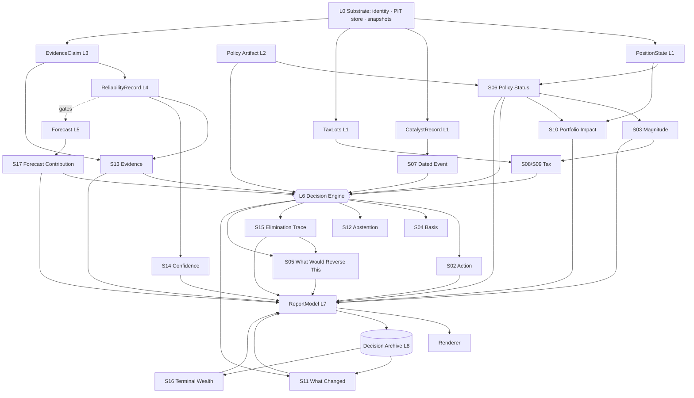

# SOFTWARE DESIGN — Report Decomposition and Module Interfaces

**Part 1 of the V4 brief.** Section inventory derived mechanically from the frozen packets, not from
memory.

---

## 1 · Section contract

Sixteen distinct sections appear across the six report-bearing cases. Case F (sham) has no report and
constrains the pipeline to support a **no-report** outcome.

| # | Section | Cases | Purpose | Layer | Deterministic | Narrative |
|---|---|---|---|---|---|---|
| S01 | **Header** `POSITION REVIEW — <name>` | all 6 | Identify the position | L1 | Yes | No |
| S02 | **ACTION** (+ `(mandated)`) | all 6 | The decision | L6 | Yes | No |
| S03 | **MAGNITUDE** (pp + $) | A,C,G | Size of the action, natural units | L2→L6 | Yes | No |
| S04 | **BASIS** | all 6 | One-line dominant basis | L6 | Yes | Template |
| S05 | **WHAT WOULD REVERSE THIS** | **all 6** | Boundary conditions | L6 | Yes | Template |
| S06 | **POLICY STATUS** | **all 6** | Weight vs limits, in pp | L2 | Yes | No |
| S07 | **DATED EVENT** | B | PIT-verified catalyst | L1 | Yes | No |
| S08 | **TAX DETAIL** | C,G | Gain realised vs budget | L2 | Yes | No |
| S09 | **TAX NOTE** | D | Loss available vs budget | L2 | Yes | No |
| S10 | **PORTFOLIO IMPACT** | A,C,G | Sector delta, own concentration `w²` | L1→L2 | Yes | No |
| S11 | **WHAT CHANGED SINCE LAST REVIEW** | **all 6** | Diff vs archived prior | L8→L6 | Yes | Template |
| S12 | **ABSTENTION** | D,E | Explicit "no view" | L6 | Yes | Fixed text |
| S13 | **EVIDENCE** (`— SHOWN UNRECONCILED` in E) | all 6 | Claims, tier-labelled, both sides | L3+L4 | Yes | Claim text authored by source |
| S14 | **CONFIDENCE** | **all 6** | Basis-typed, never one number | L4→L6 | Yes | Template |
| S15 | **WHY NOT THE ALTERNATIVES** | **all 6** | Elimination trace | L6 | Yes | Template |
| S16 | **TERMINAL-WEALTH DISCLOSURE** | **all 6** | Realised vs do-nothing | L9 | Yes | **Fixed "not available" until L8 has history — Amendment 001 A-004** |
| S17 | **FORECAST CONTRIBUTION** | A–E | Audit of L5 influence | L5 | Yes | No |
| S18 | ~~ACTION STRENGTH~~ | G only | Study arm only | — | — | **PRODUCTION-DEAD — see §4** |

**Seven sections are universal** (S05, S06, S11, S14, S15, S16, and S02). Those seven plus S03/S10
constitute the minimum a production engine must emit; the rest are conditional on case shape.

## 2 · Per-section specification

Format: *inputs → outputs · calculations · policy rules · evidence · history · dependencies*

**S02 ACTION** · in: `PositionState`, `Policy`, `EvidenceClaim[]`, `ReliabilityRecord[]` → out:
`Action`, `mandated: bool` · calc: none directly — output of the L6 stage cascade · policy: hard
limits, objective ordering · evidence: may modulate only within the feasible set · history: none ·
depends S06, S13, S14.

**S03 MAGNITUDE** · in: excess pp, `portfolio_value` → out: `(pp, dollars)` · calc **C4**
`excess_pp/100 × portfolio_value` · policy: which limit binds · depends S06.

**S05 WHAT WOULD REVERSE THIS** · in: every contribution in the trace → out: ordered
`BoundaryCondition[]` · calc: per contribution, solve for the threshold at which the action changes ·
depends S02, S06, S15. **Highest-value section per the study design and structurally the hardest** —
it requires the engine to invert its own decision function.

**S06 POLICY STATUS** · in: `weight_pct`, `Policy` → out: rows + breach flags · calc **C1** cap excess,
**C2** band excess, **C3** target deviation · deterministic, cacheable, PIT.

**S07 DATED EVENT** · in: `CatalystRecord(as_of)` → out: kind, days_until, source, confirmed · **PIT
critical**: only events whose *announcement date* ≤ `as_of` are admissible. No forward calendars from
non-PIT sources.

**S08/S09 TAX** · in: lots, `gains_budget`, magnitude → out: gain/loss realised vs remaining budget ·
calc **C7** `magnitude$ × (1 − basis/value)`, plus lot-seasoning days · **requires real tax-lot data in
production**; the study fixtures approximate with a single blended basis.

**S10 PORTFOLIO IMPACT** · in: `weight_pct`, sector exposure, action → out: sector delta, own
concentration `w²` before/after · calc **C8**, **C9s** · **Amendment 002 binds here**: total portfolio
HHI is emitted *only* when all book weights are persisted; otherwise the engine emits `NotComputable`
and the renderer shows the own-contribution substitute.

**S11 WHAT CHANGED** · in: prior archived `PositionDecision`, current → out: diff + `ChangeDriver` ·
**suppression rule**: `change_driver == NONE` ⇒ the section is omitted. Prevents churn reporting.

**S12 ABSTENTION** · in: admissible evidence set, mandate state → out: fixed statement · fires when
`|feasible_actions| > 1 ∧ no discriminating evidence ∧ no mandate`.

**S13 EVIDENCE** · in: `EvidenceClaim[]`, `ReliabilityRecord[]` → out: for/against columns,
tier-labelled, contribution per claim · **conflict is preserved, never averaged**. Case E's
`— SHOWN UNRECONCILED` heading is emitted when opposing admissible claims exist.

**S14 CONFIDENCE** · in: `ConfidenceProfile`, `dominant_basis` → out: basis-typed statement · **hard
rule**: `recommendation_confidence ≤ historical_reliability`. Policy-arithmetic and evidence-driven
decisions use separate scales and must never be rendered on one.

**S15 WHY NOT THE ALTERNATIVES** · in: `EliminationTrace[]` → out: one line per rejected action with
stage, rule, threshold, actual · **emitted during computation, never reconstructed.**

**S16 TERMINAL-WEALTH** · in: `DecisionArchive` history → out: realised vs do-nothing, **or the fixed
"not available" text when history is empty** · this is the *only* section whose absence is itself
architecturally mandated (A-004).

**S17 FORECAST CONTRIBUTION** · in: L5 output or its absence → out: `0.0` when no DIRECTIONAL-tier
forecast exists · **must render correctly when the L5 package is not installed.**

## 3 · Dependency graph



**Critical path to a rendered report:** `L0 → PositionState → Policy Status → Decision Engine →
ReportModel → Renderer`. Evidence, Reliability and Forecast are **side branches**; severing all three
still yields every universal section.

## 4 · Module interfaces

```python
# L1
class MeasurementService(Protocol):
    def position_state(self, portfolio_id: int, security_id: int, as_of: date) -> PositionState: ...
    def book_weights(self, portfolio_id: int, as_of: date) -> Mapping[int, Decimal] | NotComputable: ...

# L2
class PolicyEngine(Protocol):
    def load(self, version: str) -> PolicyArtifact: ...
    def evaluate(self, state: PositionState, policy: PolicyArtifact) -> ConstraintEvaluation: ...

# L3 / L4  — both OPTIONAL packages
class EvidenceSource(Protocol):
    name: str; version: int
    def claims(self, ctx: DecisionContext) -> Iterable[EvidenceClaim]: ...
    def admissible_horizons(self) -> frozenset[Horizon]: ...

class ReliabilityLedgerReader(Protocol):          # NO write methods, by type
    def tier(self, source: str, horizon: Horizon, regime: Regime) -> InfluenceTier: ...
    def record(self, source: str, horizon: Horizon, regime: Regime) -> ReliabilityRecord: ...
    def snapshot_id(self) -> str: ...

# L6
class DecisionEngine(Protocol):
    def decide(self, ctx: DecisionContext, horizon: Horizon
               ) -> tuple[PositionDecision, DecisionTrace]: ...        # trace is a RETURN VALUE

# L7  — the mandatory semantic/rendering split (risk R3)
class ReportAssembler(Protocol):
    def assemble(self, d: PositionDecision, t: DecisionTrace) -> ReportModel: ...

class Renderer(Protocol):
    def render(self, model: ReportModel) -> str: ...
```

**Two interface rules are load-bearing.** `decide()` returns the trace rather than logging it (R4), and
`ReliabilityLedgerReader` has no write surface (R5). Both are compile-time properties, not conventions.

## 5 · Case G and `action_strength`

Case G's `ACTION STRENGTH 68/100` and its decomposition are **production-dead**. ARCHITECTURE_V3
deleted the composite score outright.

Handling: `action_strength` lives **only** in `tests/acceptance/fixtures/case_g/` as an expected value,
computed by a prototype-only function `legacy_action_strength()` in `mip_proto.legacy`. It is never
imported by production code, and an AST test asserts that.

**This is a deliberate architectural oddity worth naming: one acceptance test asserts a feature that
must never ship.** Case G is the study's exploratory arm, and the frozen contract obliges V4 to
reproduce it while forbidding it in production.
